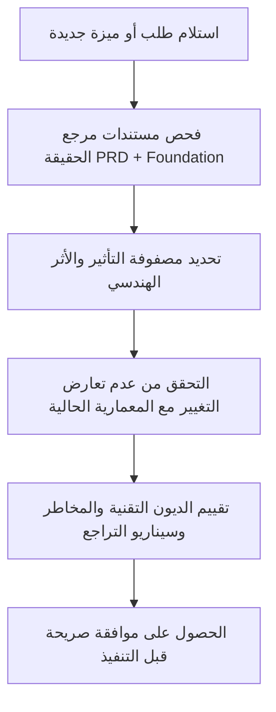

# LegalOS — Technical Implementation Plan & Architecture Validation
### خطة التنفيذ الفنية + حوكمة التطوير + تتبع تقدم المشروع

**الإصدار:** 1.0
**التاريخ:** يوليو 2026
**الحالة:** وثيقة معتمدة وموجهة للتنفيذ (Approved & Execution-Ready)

---

# 1. خلاصة التنفيذ الفني (Technical Execution Plan)

منصة LegalOS هي نظام SaaS متعدد المستأجرين مخصص لمكاتب المحاماة في المملكة العربية السعودية. يُبنى النظام على أسس تقنية تضمن الأمان التام للبيانات وعزلاً صارماً بين العملاء (Tenants)، مع توفير تكامل مرن مع خدمات وزارة العدل (منصة ناجز).

## 1.1 استراتيجية المستودع (Monorepo Strategy)
نعتمد هيكلية المستودع الموحد (Monorepo) لتسهيل إدارة الكود، وضبط عمليات البناء والتطوير، ومشاركة نماذج البيانات والـ DTOs بسهولة بين الواجهة الخلفية والأمامية.

### هيكل المستودع (Repository Structure):
```text
/legalos-monorepo
├── /backend            # تطبيق NestJS (TypeScript)
│   ├── /src
│   │   ├── /common     # Middleware, Guards, Filters المشتركة
│   │   ├── /database   # Migration files, Entity definitions
│   │   ├── /modules    # Modules (Users, Cases, Najiz, Billing)
│   │   └── main.ts
│   ├── package.json
│   └── tsconfig.json
├── /frontend           # تطبيق Flutter (Dart)
│   ├── /lib
│   │   ├── /core       # Theme, Localization, Network client
│   │   ├── /features   # Clean Architecture Features (auth, cases, client_portal)
│   │   └── main.dart
│   └── pubspec.yaml
├── /infra              # تكوينات البنية التحتية والتشغيل
│   ├── docker-compose.yml
│   └── /postgres       # Scripts لإعداد قاعدة البيانات والـ RLS
└── README.md
```

---

# 2. تهيئة وتأسيس الأنظمة (System Initialization)

## 2.1 الواجهة الخلفية (Backend Initialization - NestJS)
* **الإطار البرمجي:** NestJS.
* **إدارة قاعدة البيانات:** TypeORM أو Prisma مع تفعيل Dynamic Connection Manager لضمان عزل الـ Connection حسب هوية الـ Tenant.
* **إدارة أمن الوصول:** استخدام رموز JWT تحتوي على حقول `tenant_id` و `user_id` و `role`.
* **مستودع المزامنة:** طبقة محاكاة (Mock Service) لتكامل ناجز لتمكين التطوير دون توقف.

## 2.2 الواجهة الأمامية (Flutter Initialization)
* **الهيكلية:** Clean Architecture (Data, Domain, Presentation).
* **إدارة الحالة:** Riverpod أو BLoC.
* **اللغات والاتجاهات:** دعم اللغة العربية بشكل أساسي مع اتجاه RTL (Right-to-Left)، وتجهيز قواميس الترجمة لتسهيل التدويل لاحقاً.
* **التصميم:** تصميم عصري متناسق مع هوية بصرية متميزة (Glassmorphism، تأثيرات تحويم ذكية، ألوان متناسقة تناسب بيئة العمل القانونية الفاخرة).

## 2.3 البنية التحتية والـ Docker (Infrastructure Layout)
توفير بيئة تطوير محلية مطابقة لبيئة الإنتاج من خلال Docker Compose:
- **PostgreSQL 16:** لتخزين البيانات وتشغيل محرك RLS.
- **Redis 7:** لإدارة الكاش، والتحكم بمعدل الطلبات (Rate Limiting)، وإدارة طوابير المهام الخلفية (Queues).

---

# 3. عزل البيانات والتحقق (Multi-Tenancy & RLS Validation)

## 3.1 إعداد قاعدة البيانات والتحقق من RLS
تُطبق سياسة Row-Level Security (RLS) على مستوى جداول قاعدة البيانات لتفادي تسريب البيانات بأي خطأ برمجي.

### آلية العمل:
1. عند كل اتصال بقاعدة البيانات، يقوم الـ Middleware الخاص بالواجهة الخلفية بتمرير معرف المستأجر الحالي كـ Local Configuration Parameter:
   ```sql
   SET LOCAL app.current_tenant_id = 'tenant-uuid';
   ```
2. تقوم السياسات (Policies) في PostgreSQL بفلترة البيانات تلقائياً بناءً على هذا البارامتر:
   ```sql
   ALTER TABLE cases ENABLE ROW LEVEL SECURITY;
   CREATE POLICY tenant_isolation_cases ON cases
       USING (organization_id = current_setting('app.current_tenant_id', true)::UUID);
   ```

## 3.2 خطة التحقق والجاهزية (Verification Plan)
* **اختبارات RLS التلقائية:** تشغيل سيناريوهات اختبارية تحاكي محاولة وصول مستخدم من المستأجر A إلى بيانات المستأجر B، والتأكد من استجابة قاعدة البيانات برفض الوصول أو إرجاع نتائج فارغة.
* **اختبارات التكامل للـ API:** التحقق من أن طلبات الـ HTTP التي تحمل JWT خاص بالمستأجر A ترجع خطأ `404 Not Found` عند طلب تفاصيل قضية تخص مستأجراً آخر.

---

# 4. الحوكمة الهندسية وإدارة التنفيذ (Engineering Governance)

يعمل الـ AI بصفتي **CTO** و **Delivery Manager**. يُلزم باتباع آليات الحوكمة التالية بدقة متناهية:



## 4.1 معايير التحقق قبل بدء أي ميزة (Pre-Implementation Validation)
قبل كتابة أي كود أو تعديل ملف، يجب تقييم الأثر على الأبعاد التالية:
1. **الموديولات المتأثرة (Affected Modules):** ما هي الكيانات والـ APIs المتأثرة بالتغيير؟
2. **الاعتماديات (Dependencies):** هل هناك ربط مباشر مع موديولات أخرى؟ هل يؤثر على تكامل ناجز؟
3. **المخاطر (Risks):** هل يؤثر التغيير على سرعة الاستجابة أو أمان RLS؟
4. **الديون التقنية (Technical Debt):** هل هذا الحل مؤقت أم دائم؟ وهل يلتزم بالمعايير الهندسية؟
5. **أثر الهجرة (Migration Impact):** هل يحتاج تعديلاً في Schema قاعدة البيانات أو تشغيل Migration script؟
6. **أثر الاختبار (Testing Impact):** ما هي الاختبارات المطلوبة لتأكيد الجودة والامتثال؟
7. **أثر النشر (Deployment Impact):** هل يتطلب تحديثات في ملفات الـ Docker أو إعدادات متغيرات البيئة؟

---

# 5. إدارة تقدم المشروع (Project Progress Tracking)

يقوم الـ AI بتحديث مؤشرات التقدم تالياً بصفة مستمرة في كل رد:

* **الطور الحالي (Current Phase):** Phase 3 (Technical Planning) & Sandbox Setup
* **السباق الحالي (Current Sprint):** Sprint 1 (Boilerplate & Foundation)
* **التقدم الإجمالي للمشروع (Overall Progress %):** 10%
* **جاهزية الإنتاج (Production Readiness %):** 5%
* **نسبة اكتمال الـ MVP (MVP Completion %):** 10%
* **إصدار النسخة (Release Version):** v0.1.0-alpha
* **المخاطر المعروفة (Known Risks):**
  - تأخر اتفاقية مشاركة البيانات مع وزارة العدل (تم التخفيف بتصميم Mock Adapter).
  - تعقيد تطبيق RLS عبر الـ ORM في البيئة المشتركة.
* **الديون التقنية المرصودة (Technical Debt):**
  - عدم وجود شهادات تشفير حقيقية في بيئة التطوير المحلية (استخدام Local SSL self-signed).
* **سجل القرارات المعمارية (Architecture Decisions - ADR):**
  - [ADR-001] اختيار Shared Database + PostgreSQL RLS لضمان الأمان والجدوى الاقتصادية.
  - [ADR-002] اعتماد استراتيجية التوكن (الخيار A): كل عميل يسجل في ناجز مطورين بنفسه لتقليل المسؤوليات القانونية.
  - [ADR-003] هيكلية Monorepo لتطبيق الواجهة الخلفية والأمامية معاً.

---

# 6. موجهات حوكمة التنفيذ (Implementation Authority)

تعتبر وثيقة خطة التنفيذ الفني والمصادقة المعمارية مرجعاً ملزماً. لا يُسمح بإجراء أي تغيير هيكلي أو إعادة تصميم دون موافقة صريحة.
في حال وجود تعارض بين طلبات المستخدم والقرارات المعمارية المعتمدة:
1. **توضيح التعارض:** تحديد موطن التعارض في الوثائق بدقة.
2. **شرح الأثر:** توضيح أثر التغيير المقترح على الأداء، التكلفة، أو الأمان.
3. **توصية البديل:** تقديم خيارات بديلة تحقق الهدف دون المساس بالأساس المعماري.
4. **انتظار الموافقة:** عدم إجراء أي تغيير حتى صدور موافقة صريحة من العميل.
